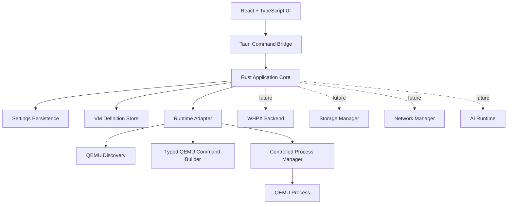

<div align="center">

# NexoraVM

### Windows-first desktop virtualization and AI workspace

Build, configure, diagnose, and eventually operate virtual machines through a secure, typed desktop experience built with Tauri, React, TypeScript, and Rust.

<p>
  
  
  
  
  
  
  
  
</p>

<p>
  <a href="docs/README.md"><strong>Documentation</strong></a>
  &middot;
  <a href="docs/architecture.md"><strong>Architecture</strong></a>
  &middot;
  <a href="docs/roadmap.md"><strong>Roadmap</strong></a>
  &middot;
  <a href="CONTRIBUTING.md"><strong>Contributing</strong></a>
  &middot;
  <a href="SECURITY.md"><strong>Security</strong></a>
  &middot;
  <a href="https://github.com/vmDeshpande/NexoraVM/issues"><strong>Issues</strong></a>
</p>

<p>
  <a href="#quick-start">Quick Start</a>
  &middot;
  <a href="#what-exists-today">What Exists Today</a>
  &middot;
  <a href="#architecture-at-a-glance">Architecture</a>
  &middot;
  <a href="#roadmap">Roadmap</a>
</p>

</div>

---

## Overview

NexoraVM is an open-source Windows-first desktop application for managing virtual-machine definitions, local virtualization runtimes, and AI-assisted workflows from one focused workspace.

The project is intentionally being built in layers. The current foundation covers persistent VM configuration, runtime diagnostics, safe QEMU command construction, and controlled QEMU process management. Guest display, storage, networking, advanced lifecycle recovery, and the AI workspace are being developed as separate milestones rather than being coupled prematurely.

> **Project status:** active early development. NexoraVM is not production-ready and should be treated as an experimental project while the runtime and guest-management layers mature.

## What Exists Today

| Area | Status | Current capability |
| --- | --- | --- |
| Desktop shell | ✅ Implemented | Tauri v2 desktop shell, navigation, dashboard, settings, and VM workspace. |
| Persistent settings | ✅ Implemented | Typed settings persisted in the OS application-data directory. |
| VM definitions | ✅ Implemented | Persistent VM configuration with UUID-based identifiers and validation. |
| VM management | ✅ Implemented | Create, edit, delete, validation, status display, and runtime controls. |
| Runtime discovery | ✅ Implemented | Bounded QEMU discovery, executable validation, and fixed version probing. |
| QEMU command construction | ✅ Implemented | Deterministic typed command specifications with no shell execution. |
| QEMU process management | ✅ Implemented | Controlled validated process start/stop, monitoring, bounded output, and lifecycle state. |
| VM runtime integration | 🟡 Partial | Managed process lifecycle exists; complete guest/runtime synchronization is still being built. |
| WHPX execution | ⏳ Planned | Windows capability fields exist, but WHPX execution is not implemented. |
| Virtual storage | ⏳ Planned | Storage preferences exist; disk creation and management are not implemented. |
| Networking | ⏳ Planned | VM network modes are modeled; host networking is not configured. |
| Guest display / console | ⏳ Planned | Full display, input, and guest interaction layer is not implemented. |
| Snapshots | ⏳ Planned | Snapshot and restore workflows are not implemented. |
| AI workspace | ⏳ Planned | Product area is defined; model runtime and AI tools are not implemented. |
| AI model providers | ⏳ Planned | No local or cloud model provider runtime is integrated yet. |
| Release packaging | 🟡 Partial | Development builds work; a production-ready installer/release process is still being hardened. |

## Screenshots

Screenshots will be added once a repeatable desktop capture workflow is established. Until then, the repository intentionally avoids broken or unverified image links.

## Architecture At A Glance



| Layer | Responsibility |
| --- | --- |
| **React + TypeScript** | Desktop UI, forms, dashboards, typed service calls, and user-visible runtime state. |
| **Tauri** | Desktop shell and narrow bridge between the frontend and trusted native operations. |
| **Rust core** | Persistence, validation, runtime discovery, command construction, process management, and structured errors. |
| **Runtime adapter** | Provider-neutral boundary for virtualization backends such as QEMU and future WHPX support. |
| **QEMU layer** | Discovery, typed command construction, and controlled process lifecycle. |
| **Future AI runtime** | Model providers, tool permissions, planning, and AI-assisted VM workflows. |

See [Architecture](docs/architecture.md) for detailed data flow, boundaries, and design decisions.

## Why NexoraVM

<table>
  <tr>
    <td width="33%">
      <strong>Typed by design</strong><br>
      VM configuration, runtime capabilities, command specifications, and process states are represented as explicit models rather than loose strings.
    </td>
    <td width="33%">
      <strong>Security-conscious</strong><br>
      Native execution is deliberately constrained: no shell interpreters, no generic command runner, and no unnecessary administrator privileges.
    </td>
    <td width="33%">
      <strong>Built in layers</strong><br>
      Configuration, runtime, storage, networking, and AI are kept behind explicit boundaries so the system can grow without turning the UI into a monolith.
    </td>
  </tr>
</table>

## Technology Stack

| Technology | Purpose |
| --- | --- |
| **Tauri v2** | Windows desktop shell and native command bridge. |
| **React** | Component-based desktop UI. |
| **TypeScript** | Frontend types, service contracts, and domain models. |
| **Vite** | Frontend development and production bundling. |
| **Rust** | Native application core, persistence, validation, diagnostics, and process management. |
| **QEMU** | Planned/current virtualization runtime used through validated process specifications. |
| **WHPX** | Planned Windows acceleration backend. |

## Quick Start

### Prerequisites

- Windows 11 recommended.
- Node.js and npm.
- Rust stable with the Windows MSVC toolchain.
- Visual Studio or Visual Studio Build Tools with the Desktop development with C++ workload.
- Tauri v2 Windows prerequisites.
- WebView2 Runtime, normally available on modern Windows installations.

On Windows, **Visual Studio Developer PowerShell** may be required for the Rust MSVC linker.

### Install dependencies

```powershell
npm ci
```

### Run the desktop application

```powershell
npm run tauri dev
```

### Build the frontend

```powershell
npm run build
```

### Build/package the desktop application

```powershell
npm run tauri build
```

A successful development/package build does not yet imply a production-ready installer or release workflow.

### Validate the Rust backend

```powershell
cargo fmt --manifest-path .\src-tauri\Cargo.toml -- --check
cargo check --manifest-path .\src-tauri\Cargo.toml
cargo test --manifest-path .\src-tauri\Cargo.toml
git diff --check
```

See [Development Guide](docs/development.md) for the complete contributor workflow and troubleshooting notes.

## Project Structure

```text
NexoraVM/
├── .github/                  GitHub Actions, Dependabot, templates
├── docs/                     Technical documentation and roadmap
├── public/                   Static frontend assets
├── src/                      React + TypeScript application
│   ├── components/           Reusable UI components
│   ├── hooks/                React hooks
│   ├── layouts/              Desktop shell layout
│   ├── lib/                  Frontend services and shared utilities
│   ├── pages/                Dashboard, Settings, VM management, placeholders
│   └── types/                Frontend domain models
├── src-tauri/                Rust/Tauri application core
│   ├── src/                  Commands, models, persistence, runtime code
│   ├── capabilities/         Tauri capability configuration
│   ├── Cargo.toml             Rust package/dependencies
│   └── tauri.conf.json        Tauri application configuration
├── CONTRIBUTING.md           Contribution guidelines
├── SECURITY.md               Security policy and threat model
├── SUPPORT.md                Support and troubleshooting guidance
├── CHANGELOG.md              Project change history
└── README.md                 Project entry point
```

## Configuration and Persistence

NexoraVM keeps application settings and VM definitions separate from live runtime state.

Application settings are stored as `settings.json` in the OS application-data directory. VM definitions are stored separately as `vm-definitions.json`. Live QEMU process handles and runtime state remain managed in memory and are not persisted as if they were durable VM configuration.

See [Configuration](docs/configuration.md) and [Runtime](docs/runtime.md) for details.

## Security Model

Virtualization and native process execution are security-sensitive parts of the system. NexoraVM therefore uses explicit typed boundaries between UI input, VM configuration, command construction, and process execution.

The current design intentionally avoids:

- Shell interpreters such as `cmd.exe`, PowerShell, or `sh -c` for QEMU execution.
- Arbitrary executable paths or arbitrary raw QEMU argument arrays from the frontend.
- Unrestricted generic process-execution commands.
- Unnecessary administrator privileges.
- Automatic host networking or firewall changes.
- Broad process scanning or adoption of unrelated QEMU processes.

See [SECURITY.md](SECURITY.md) for the current security model and known deferred work.

## Roadmap

NexoraVM is being developed in explicit milestones so each boundary can be tested before the next layer depends on it.

1. ✅ Desktop application foundation
2. ✅ Persistent configuration foundation
3. ✅ VM definition management
4. ✅ Runtime discovery and diagnostics
5. ✅ Safe QEMU command construction
6. ✅ Controlled QEMU process management
7. ✅ VM runtime-state synchronization
8. ⏳ Guest display and console integration
9. ⏳ Storage and networking
10. ⏳ AI workspace and model providers
11. ⏳ AI-assisted VM workflows
12. ⏳ Release hardening

The detailed and canonical roadmap is [docs/roadmap.md](docs/roadmap.md).

## Contributing

NexoraVM is an active open-source development project. Contributions should be focused, typed, tested, documented, and security-conscious.

Start with:

- [CONTRIBUTING.md](CONTRIBUTING.md)
- [Development Guide](docs/development.md)
- [Architecture](docs/architecture.md)
- [Security Policy](SECURITY.md)

## Support

For troubleshooting and issue-reporting guidance, see [SUPPORT.md](SUPPORT.md). Before opening an issue, check the relevant documentation and existing issues where practical.

## License

Licensing is not yet specified. A license should be added before broad distribution or accepting contributions under public reuse terms.

## Disclaimer

NexoraVM is under active development and is not production-ready. APIs, persistence formats, runtime behavior, and security boundaries may change before a supported release.

## Documentation

| Document | Purpose |
| --- | --- |
| [Documentation Index](docs/README.md) | Entry point for project documentation. |
| [Overview](docs/overview.md) | Project goals, scope, and current maturity. |
| [Architecture](docs/architecture.md) | System architecture, data flow, and boundaries. |
| [Current Status](docs/current-status.md) | What is implemented today and what remains. |
| [Roadmap](docs/roadmap.md) | Canonical phased development plan. |
| [Development](docs/development.md) | Local setup, checks, tests, and contributor workflow. |
| [Configuration](docs/configuration.md) | Settings and VM-definition persistence. |
| [Runtime](docs/runtime.md) | Runtime discovery, QEMU, and process-management behavior. |
| [Decisions](docs/decisions.md) | Architectural decisions and rationale. |
| [Contributing](CONTRIBUTING.md) | Contribution and pull-request guidance. |
| [Security](SECURITY.md) | Security model and reporting guidance. |
| [Support](SUPPORT.md) | Troubleshooting and issue-reporting guidance. |
